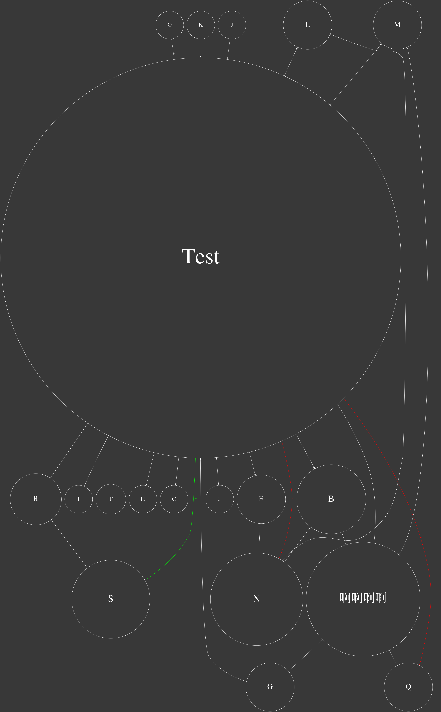

# thebrain2dot

thebrain10 `.json` (File>Export>JSON Files 
) to `.dot` visualization with Graphviz

- Nodes
    - support types
    - size depends on PageRank centrality
- Links
    - support types, directions, colors

Before:


After:



More Complicated Example:


## API

Example: see [test/test.py](test/test.py)

```python
brain_json2dot(thoughts_path, links_path, dot_path='thebrain.dot', png_path='thebrain.png', 
                layout='dot', bg_color='grey22', node_shape='circle', node_color='white', 
                edge_default_color='white', edge_splines='', edge_font_size=10)
```

The Function will output both `.dot` file + `.png` file), recommended Tool for `.dot`: MS Code + [Graphviz Interactive Preview](https://marketplace.visualstudio.com/items?itemName=tintinweb.graphviz-interactive-preview)

## Dependency

### Graphviz

Ubuntu:

```bash
apt install -y graphviz
```

Windows: TODO

### Pygraphviz

Ubuntu:

```bash
apt-get install -y graphviz-dev
pip install pygraphviz
```

Windows: TODO


## TODO

- Doc: parsing of thebrain10's `thoughts.json` & `links.json`
- Dev: publish package to PYPI
- Parsing: correct color mapping (thebrain exported json seems to have bugs about color)
- Layout: label / tag
- Layout: parent / sibling location restriction in visualization
- Layout: community detection
